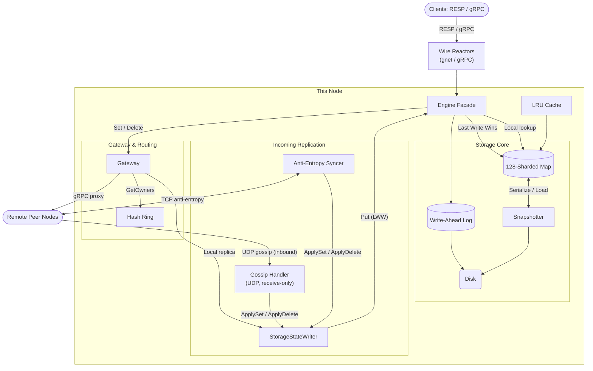

# oryx

oryx is a partitioned, state-replicated key-value database implemented in Go. In CAP theorem, oryx is AP in the style of Cassandra or ScyllaDB.

## Features

- Consistent-hash partitioning and direct write replication
- Gossip membership propagation (UDP)
- Hybrid logical clock (HLC) LWW conflict resolution
- 3-level Merkle tree anti-entropy state synchronization
- Multi-segment write-ahead log (WAL) crash durability
- High-concurrency sharded memory map (128 independent locks)
- Active snapshot persistence and recovery serialization
- Dynamic LRU cache TTL eviction
- `gnet/v2` multi-core event loop reactor
- Native Redis RESP wire protocol + gRPC Client and Server API

## Performance & Benchmarks

All benchmarks conducted locally on an Apple M4 Max (14 cores, 64GB RAM, Go 1.27.1) and LinuxKit Kernel 6.12.

### 1. Storage Core Benchmark vs Production Go DBs
```bash
cd benchmarks && go test -bench=BenchmarkComparative_Get_Parallel -benchmem ./...
```

| Database Engine | Throughput (Reads/sec) | Latency (ns/op) | Memory/op | Allocs/op |
| :--- | :--- | :--- | :--- | :--- |
| sync.Map (Go Stdlib Baseline) | 975,489,800 reads/s | 1.25 ns | 0 B | 0 allocs |
| oryx (Sharded Core) | 97,853,475 reads/s | 12.21 ns | 0 B | 0 allocs |
| concurrent-map (Orcaman) | 55,129,110 reads/s | 21.69 ns | 0 B | 0 allocs |
| BuntDB (In-Memory + AOF) | 7,401,095 reads/s | 161.80 ns | 72 B | 2 allocs |
| CockroachDB Pebble | 7,335,370 reads/s | 163.70 ns | 8 B | 1 allocs |
| NutsDB | 4,254,405 reads/s | 282.20 ns | 272 B | 7 allocs |
| BadgerDB (Dgraph) | 1,770,595 reads/s | 680.50 ns | 360 B | 7 allocs |
| bbolt (etcd / Kubernetes) | 1,000,000 reads/s | 1,004.00 ns | 480 B | 8 allocs |

### 2. Storage Engine Micro-benchmarks
Micro-benchmarks measuring direct storage interaction with the 128-sharded memory core + WAL (`go test -bench=. -benchmem`):

| Benchmark | Workload / Operation | Throughput (ops/sec) | Latency | Memory / Allocations |
| :--- | :--- | :--- | :--- | :--- |
| Get (Parallel) | Concurrent Point Reads | ~96,500,000 ops/s | 11.93 ns/op | 0 B/op (0 allocs) |
| Get (Single-thread) | Sequential Point Read | ~23,830,000 ops/s | 49.86 ns/op | 0 B/op (0 allocs) |
| Set (Parallel + WAL) | Concurrent Writes + WAL | ~1,254,000 ops/s | 904.90 ns/op | 8 B/op (0 allocs) |
| Set (Single-thread + WAL) | Sequential Write + WAL | ~5,417,000 ops/s | 209.20 ns/op | 1 B/op (0 allocs) |
| Delete (Parallel + WAL) | Concurrent Tombstones + WAL | ~186,267,000 ops/s | 6.48 ns/op | 0 B/op (0 allocs) |
| Delete (Single-thread + WAL) | Sequential Tombstone + WAL | ~100,000,000 ops/s | 11.90 ns/op | 0 B/op (0 allocs) |


## Quick Start

### 1. Start Server Node
```bash
go run cmd/oryx/main.go
```

### 2. Connect via Redis CLI
```bash
redis-cli -p 6379 SET mykey "hello world"
redis-cli -p 6379 GET mykey
```

### 3. Interact via the CLI

The `oryx` binary doubles as a CLI client with `get`, `set`, and `delete` subcommands.

```bash
# Set a key (insecure / no TLS)
oryx --insecure set mykey "hello world"

# Get a key
oryx --insecure get mykey

# Delete a key (aliases: del, rm)
oryx --insecure delete mykey

# Connect to a remote node with TLS
oryx --host 10.0.0.1 --grpc-port 50055 --tls-cert ./certs/client.crt --tls-key ./certs/client.key get mykey
```

Connection flags (`--host`, `--grpc-port`, `--insecure`, `--tls-cert`, `--tls-key`, `--timeout`) are available on every subcommand.

### 4. Connect via Go Client

```bash
go run examples/client/main.go
```

## System Architecture



## Running Benchmarks & Profiling

```bash
# Run main module benchmarks (storage core, engine micro-benchmarks)
go test -bench=. -benchmem ./...

# Run comparative benchmarks vs external DBs (isolated sub-module)
cd benchmarks && go test -bench=. -benchmem ./...

# CPU Profiling
go test -bench=. -cpuprofile=cpu.prof ./...
go tool pprof -top cpu.prof

# Memory Profiling
go test -bench=. -memprofile=mem.prof ./...
go tool pprof -top mem.prof
```
